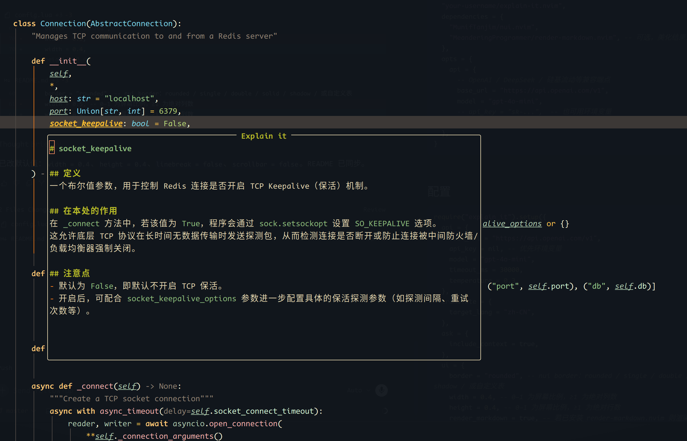

# explain-it.nvim

Neovim 插件：借助 OpenAI 兼容大模型 API，对光标处单词或可视选区做**中文解释**、**翻译**与**自由提问**。结果以 [nui.nvim](https://github.com/MunifTanjim/nui.nvim) 浮窗展示。



## 功能

| 功能 | 默认快捷键 | 命令 | 说明 |
|------|------------|------|------|
| 解释 | `<leader>ee` | `:Explain` | 先显示 `# 目标`，再流式中文解释；底部 Ask 可多轮追问 |
| 翻译 | `<leader>et` | `:ExplainTranslate` | 翻译光标单词或选中文本 |
| 提问 | `<leader>ea` | `:ExplainAsk` | 同款浮窗，只显示 `# 目标` 并聚焦 Ask，直接提问（新会话） |
| 重开 | `<leader>er` | `:ExplainLast` | 重新打开上次关闭的结果浮窗 |

普通模式与可视模式均可用；有选区时优先使用选区。

## 依赖

- Neovim 0.9+（推荐 0.10+，使用 `vim.system`）
- [MunifTanjim/nui.nvim](https://github.com/MunifTanjim/nui.nvim)
- 系统已安装 `curl`
- （可选）[MeanderingProgrammer/render-markdown.nvim](https://github.com/MeanderingProgrammer/render-markdown.nvim)：结果浮窗以 Markdown 渲染显示

## 安装（lazy.nvim）

```lua
{
  "your-username/explain-it.nvim",
  dependencies = {
    "MunifTanjim/nui.nvim",
    "MeanderingProgrammer/render-markdown.nvim", -- 可选，美化结果浮窗
  },
  opts = {
    api = {
      -- OpenAI / DeepSeek / 硅基流动等兼容端点
      base_url = "https://api.openai.com/v1",
      model = "gpt-4o-mini",
      -- api_key = "sk-...",  -- 也可用环境变量
    },
  },
}
```

## 配置

```lua
require("explain_it").setup({
  api = {
    base_url = "https://api.openai.com/v1",
    api_key = nil, -- 优先环境变量
    model = "gpt-4o-mini",
    timeout_ms = 30000,
    temperature = 0.3,
  },
  translate = {
    target_lang = "zh-CN",
  },
  ask = {
    include_context = true,
  },
  ui = {
    border = "rounded", -- nui border：rounded / single / double / solid / shadow / 或自定义表
    width = 0.4, -- 0–1 为屏幕比例，≥1 为绝对列数
    height = 0.4, -- 0–1 为屏幕比例，≥1 为绝对行数
    render_markdown = true, -- 若已安装 render-markdown.nvim 则渲染结果
    anchor = "auto", -- auto | below | above | center
    gap = 1, -- 与原文的行间距
    zindex = 50,
    enter = true, -- 打开时是否聚焦浮窗
    close_on_leave = true, -- 离开浮窗 buffer 时自动关闭
    wrap = true,
    linebreak = false,
    title_align = "center", -- left | center | right
    winhighlight = "Normal:Normal,FloatBorder:FloatBorder",
    scrollbar = false, -- false 时隐藏 nvim-scrollbar 等插件在结果浮窗上的滚动条
    -- 翻译等「自适应内容」尺寸上限（仍受 width/height 约束）
    fit = {
      max_width = 0.55,
      max_height = 0.35,
      min_width = 24,
      min_height = 3,
    },
  },
  keymaps = {
    explain = "<leader>ee",
    translate = "<leader>et",
    ask = "<leader>ea",
    reopen = "<leader>er", -- 重新打开上次结果
    follow_float = "i", -- 结果浮窗内容区聚焦底部 Ask；设为 false 可禁用
    -- 设为 false 可禁用某一快捷键
  },
})
```

### API Key

按优先级读取：

1. `setup({ api = { api_key = "..." } })`
2. 环境变量 `EXPLAIN_IT_NVIM_API_KEY`
3. 环境变量 `OPENAI_API_KEY`

### DeepSeek 示例

```lua
require("explain_it").setup({
  api = {
    base_url = "https://api.deepseek.com/v1",
    model = "deepseek-chat",
  },
})
```

## 快捷键与浮窗

- 结果浮窗：`q` / `<Esc>` 关闭
- `<leader>ee`：回答区先出现 `# 目标`，再显示 `Explaining...` 并流式出解释
- `<leader>ea`：同款浮窗，只显示 `# 目标`，自动聚焦底部 Ask（新会话，不沿用上次 ee）
- 解释 / 提问浮窗底部有 **Ask** 输入区（固定 2 行，可换行滚动）：内容区按 `i` 聚焦；`C-s` 或普通模式回车发送；插入模式回车换行
- Ask 区始终显示滚动条（不受 `ui.scrollbar` 影响）；回答区滚动条仍跟随该配置
- `<Esc>` 在输入区：回到内容区；在内容区：关闭浮窗
- 关闭后光标回到打开浮窗前的源窗口；可用 `<leader>er` / `:ExplainLast` 重开后再按 `i` 继续追问

## License

MIT
